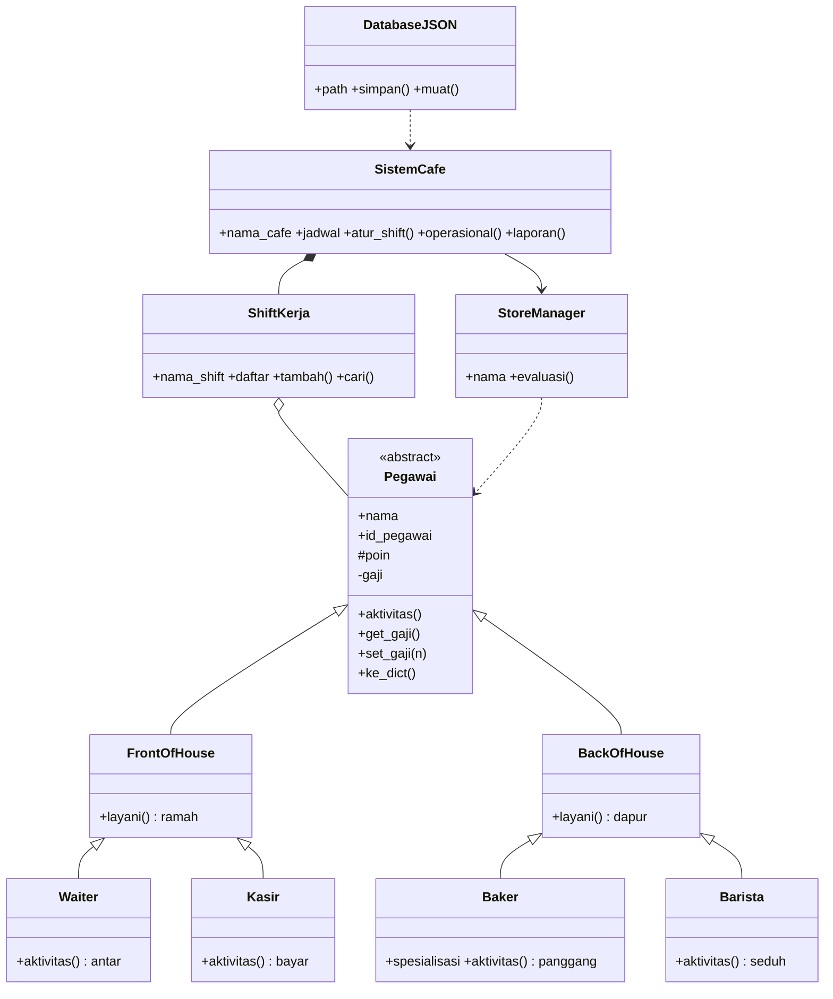

# Sistem Manajemen Kafe Belbel Cafe & Bakery — OOP + UML + JSON

Program pendataan karyawan kafe yang bermanfaat nyata: tambah karyawan,
catat gaji float tervalidasi, nilai kinerja oleh manajer, atur shift,
tampilkan operasional dan laporan, serta simpan otomatis ke JSON agar
tidak hilang saat program ditutup. Ditulis dengan sintaks pemula:
hanya `import json`, tanpa dekorator, tanpa sintaks lanjutan.

File utama: `kafe.py` (11 class) | Data: `data/karyawan.json` |
Model: `docs/UML-kafe.md` | Arsip teman: `arsip/code_baru.py` (ber-bug, jangan dikumpulkan)

## Daftar Isi

1. [Pembukaan](#1-pembukaan)
2. [Analisis Kasus dan Manfaat Dunia Nyata](#2-analisis-kasus-dan-manfaat-dunia-nyata)
3. [Model UML dan Relasi](#3-model-uml-dan-relasi)
4. [Cara Menjalankan dan Memakai Menu](#4-cara-menjalankan-dan-memakai-menu)
5. [Struktur JSON](#5-struktur-json)
6. [Penjelasan Kode per Class](#6-penjelasan-kode-per-class)
7. [Panduan Lengkap Sintaks Class untuk Pemula](#7-panduan-lengkap-sintaks-class-untuk-pemula)
8. [Tata Cara Menambah Peran Baru](#8-tata-cara-menambah-peran-baru)
9. [Bedah Konsep OOP](#9-bedah-konsep-oop)
10. [Bukti Keselarasan Model vs Program](#10-bukti-keselarasan-model-vs-program)
11. [Alur Program](#11-alur-program)
12. [Pembelajaran Bertahap](#12-pembelajaran-bertahap)
13. [Naskah Presentasi 4 Orang](#13-naskah-presentasi-4-orang)
14. [Tips Presentasi](#14-tips-presentasi)
15. [Prediksi Pertanyaan Dosen](#15-prediksi-pertanyaan-dosen)

---

## 1. Pembukaan

Proyek ini merupakan simulasi sistem informasi kafe yang dimodelkan
dengan Pemrograman Berorientasi Objek menggunakan bahasa Python.
Apabila diibaratkan dalam kehidupan nyata, kafe memiliki pegawai
dengan peran berbeda (Waiter, Kasir, Baker, Barista), shift kerja
sebagai wadah (Pagi, Sore), manajer sebagai penilai, sistem kafe
sebagai koordinator, dan database JSON sebagai arsip.

Pengguna tidak mencatat di kertas, melainkan mencetak objek nyata
seperti `Waiter("Andi","W01",3000000.0)`, memasukkannya ke shift,
menilainya, lalu menampilkan operasional. Satu perintah operasional
menampilkan empat aktivitas berbeda secara otomatis.

Kesebelas class: `Pegawai, FrontOfHouse, BackOfHouse, Waiter, Kasir,
Baker, Barista, ShiftKerja, StoreManager, SistemCafe, DatabaseJSON`.

## 2. Analisis Kasus dan Manfaat Dunia Nyata

Masalah nyata kafe kecil: data karyawan tersebar, gaji lupa dicatat,
penilaian kinerja tidak terdokumentasi, jadwal shift tertukar, data
hilang saat pergantian shift. Solusi program ini: tambah karyawan
lewat ketikan dengan validasi (ID unik, gaji angka positif float),
timbang gaji ulang via `set_gaji()`, evaluasi manajer (+10 poin,
maks 200), laporan dan operasional sebagai rekap harian, simpan ke
`data/karyawan.json` sehingga besok dibuka tetap ada.

Contoh manfaat yang sudah teruji: tambah Eka (W02) ke Pagi, tolak
duplikat W02, tolak gaji huruf, nilai Andi (W01) 100 menjadi 110 dan
tersimpan, operasional bertambah satu baris tanpa mengubah kode
`operasional()`.

## 3. Model UML dan Relasi

Diagram lengkap di `docs/UML-kafe.md`. Ringkasan:



Makna: Generalization 6 panah (warisi tanpa tulis ulang),
Composition kebun-shift (`self.jadwal`, `atur_shift`),
Aggregation shift-pegawai (`self.daftar`, `tambah`),
Dependency manajer-pegawai (`def evaluasi(self,p)`),
Dependency JSON (`simpan(cafe)/muat(cafe)`).

Abstraksi memakai `pass` agar mudah dipahami pemula (kontrak kosong,
bukan `ABC` ketat). Konsekuensinya induk masih bisa dibuat langsung
dan hasilnya `None` — ini keterbatasan yang disengaja dan menjadi
bahan Q&A, bukan bug tersembunyi.

## 4. Cara Menjalankan dan Memakai Menu

```bash
python kafe.py
```

Menu:

```
1 Tambah | 2 Laporan | 3 Evaluasi | 4 Operasional | 5 Simpan+Keluar
```

Tata cara: pilih 1 isi Nama, ID unik, Gaji angka positif, peran 1-4,
shift tujuan (baru otomatis dibuat). Pilih 2 untuk tabel, 3 isi ID
untuk +10 poin, 4 untuk parade aktivitas, 5 untuk simpan dan keluar.
Wajib keluar via 5 agar tersimpan. Data awal otomatis dibuat bila
JSON belum ada.

## 5. Struktur JSON

`data/karyawan.json`:

```json
{
  "nama_cafe": "Belbel Cafe",
  "shift": [{"nama": "Pagi", "isi": [
    {"peran": "Waiter", "nama": "Andi", "id": "W01", "gaji": 3000000.0, "poin": 100},
    {"peran": "Baker", "nama": "Cici", "id": "B01", "gaji": 4000000.0, "poin": 100, "spesialisasi": "Pastry"}
  ]}]
}
```

`peran` wajib agar `buat_pegawai()` tahu membuat class yang tepat.
Gaji diambil via `get_gaji()` karena `__gaji` private. Data asing
(`peran` tak dikenal) diberi peringatan dan dianggap Waiter agar
tidak diam-diam salah.

## 6. Penjelasan Kode per Class

### 6.1 `Pegawai` — induk abstrak
`__init__(nama, id_pegawai, gaji)` mengisi `nama/id` public,
`_poin=100` protected, `__gaji` private. `aktivitas(): pass`
sengaja kosong sebagai kontrak. `get_gaji/set_gaji(>0)`,
`get_poin`, `info()`, `ke_dict()` untuk JSON.

### 6.2 `FrontOfHouse`, `BackOfHouse`
`FrontOfHouse(Pegawai)` mengisi `layani()` ramah,
`BackOfHouse(Pegawai)` mengisi `layani()` dapur. Diwarisi ke anak.

### 6.3 `Waiter, Kasir, Baker, Barista`
Masing-masing mengisi `aktivitas()` berbeda. `Baker` contoh
`__init__+super().__init__+spesialisasi` dan override `ke_dict`.
`Waiter("Andi","W01",3000000.0)` bisa walau tanpa `__init__`
karena warisan.

### 6.4 `ShiftKerja`, `StoreManager`, `SistemCafe`, `DatabaseJSON`
`ShiftKerja`: `daftar=[]`, `tambah(p)`, `cari(id)`, `ke_dict()`.
`StoreManager`: `evaluasi(p)` tambah poin maks 200.
`SistemCafe`: `jadwal=[]`, `atur_shift`, `cari_shift/pegawai`,
`operasional()` loop `p.aktivitas()`, `laporan()` tabel.
`DatabaseJSON(path)`: `simpan` dump, `muat` load, gagal False.
Tanpa dekorator, metode biasa. Fungsi bebas: `buat_pegawai`,
`buat_shift`, `contoh_awal`, `tanya_angka`, `menu`.

## 7. Panduan Lengkap Sintaks Class untuk Pemula

Rumus dasar: `class Nama:` menjorok 4 spasi. Nama PascalCase.
`def __init__(self,...):` otomatis jalan saat
`andi = Waiter("Andi","W01",3000000.0)`. `self` artinya objek ini
dan wajib parameter pertama. `self.nama=nama` menempelkan data.
Warisan: `class Anak(Induk):`, contoh `class Waiter(FrontOfHouse):`.
`super().__init__(...)` meminjam init induk sebelum tambah atribut
baru (contoh `Baker`). Method: `def nama(self):` + `return`,
dipanggil `andi.aktivitas()`. `pass` artinya kosongkan.
Komposisi: `self.daftar=[]` + `tambah(p)` menampung objek lain.
Empat langkah pakai class: definisikan → wariskan bila perlu →
lahirkan di Main/menu → gunakan (`p.aktivitas()`, `get_gaji()`).

## 8. Tata Cara Menambah Peran Baru

Pilih induk terdekat: pelayan → `FrontOfHouse`, dapur →
`BackOfHouse`. Override `aktivitas()` (dan `layani()` bila perlu),
buat instance, masukkan via `shift.tambah()`, uji di operasional.
Contoh: `class CleaningService(BackOfHouse): def aktivitas(self):
return "Membersihkan meja."` lalu otomatis ikut operasional.
Bila butuh atribut baru, tiru `Baker` (`super` + `ke_dict`).
Checklist: `return` bukan `print`, ID unik, uji `get/set`,
pastikan muncul di operasional tanpa ubah `operasional()`.
Kesalahan umum: lupa `self`, salah induk, `__init__` tanpa `super`.

## 9. Bedah Konsep OOP

Abstraksi: `Pegawai` kontrak kosong. Inheritance:
`Waiter(FrontOfHouse(Pegawai))` warisi nama/id/gaji/poin.
Polimorfisme: satu `p.aktivitas()` → antar/bayar/panggang/seduh,
satu `p.layani()` → ramah/dapur, tanpa `if` di operasional.
Enkapsulasi: `__gaji` via getter/setter, `_poin` via manajer.
Konstruktor/Instance: `__init__` nilai awal,
`andi=Waiter(...)` wujud nyata di Main/menu.

## 10. Bukti Keselarasan Model vs Program

| UML | Kode `kafe.py` | Uji |
|---|---|---|
| 11 class | 11 nama sama, 0 dekorator | AST cocok |
| Abstract `pass` | `def aktivitas: pass` | Lupa override → `None` |
| `Baker+super+spesialisasi` | `super().__init__`, override `ke_dict` | JSON simpan spesialisasi |
| Composition/Aggregation | `jadwal/atur_shift`, `daftar/tambah` | Eka masuk Pagi |
| Validasi | `set_gaji>0`, ID unik, `tanya_angka` | -5/huruf/duplikat ditolak |
| JSON round-trip | `simpan/muat`, `buat_pegawai` | Tutup-buka cocok, poin 110 awet |
| Polimorfisme | `operasional()` loop | Tambah peran tanpa ubah metode |

Perbaikan dari `arsip/code_baru.py`: tambah `self.id_pegawai`
(crash diperbaiki), buang dekorator/`os`/`with`, rapikan nama dan
path, gaji float, muat umum semua shift, ID unik, poin dibatasi.

## 11. Alur Program

`muat(data/karyawan.json)` → bila gagal `contoh_awal+simpan` →
`laporan+operasional` awal → `menu()` loop 1-5 → keluar `simpan()`.
Tambah/timbang/nilai langsung bisa dicek via laporan/operasional.

## 12. Pembelajaran Bertahap

1. Bedakan class vs objek (`Waiter` vs `andi`).
2. Telusuri `__init__` dan `super()` di `Baker`.
3. Uji enkapsulasi (`get/set_gaji`, manajer).
4. Telusuri rantai `Pegawai→Front→Waiter`.
5. Jalankan operasional, amati satu perintah banyak hasil.
6. Tambah peran baru dan simpan-muat JSON.

## 13. Naskah Presentasi 4 Orang

Pembagian: 1 pembuka+UML+abstraksi/inheritance, 2 polimorfisme+demo,
3 enkapsulasi+konstruktor+menu/JSON, 4 bukti+alur+penutup.

> Assalamu'alaikum. Kami mempresentasikan `kafe.py`: Sistem Manajemen
> Belbel Cafe, 11 class, hanya `import json`, tanpa dekorator.
> Masalah nyata: data kertas hilang. Solusi: input shift, gaji float
> tervalidasi, evaluasi manajer, simpan JSON.
> Induk `Pegawai` berisi kontrak kosong `pass`, dilengkapi anak:
> Front ramah, Back dapur, Waiter antar, Kasir bayar, Baker panggang
> plus spesialisasi via `super`, Barista seduh.
> Satu perintah `p.aktivitas()` di `operasional()` menghasilkan empat
> keluaran beda tanpa `if`. Gaji private hanya via getter/setter,
> poin protected via manajer. Objek lahir di Main/menu, contoh
> `andi=Waiter(...)`. Alur: muat, laporan, menu, simpan.
> Bukti: tambah Eka, tolak duplikat, evaluasi 110, JSON awet.
> Kelemahan: `pass` belum memaksa, belum hapus/pindah. Siap tanya jawab.
> Wassalamu'alaikum.

Orang 1 baca paragraf 1-2 + tunjuk UML. Orang 2 tunjuk operasional
dan jalankan menu 4. Orang 3 tunjuk `set_gaji` dan demo menu 1-3-5
plus buka JSON. Orang 4 tunjuk tabel bukti dan tutup.

## 14. Tips Presentasi

Awali masalah kafe nyata, demo operasional langsung, tunjukkan
penolakan (duplikat, huruf, negatif) dan bukti JSON tetap ada.
Jangan baca semua baris, tunjuk 3 titik: `pass`, `p.aktivitas()`,
`set_gaji`.

## 15. Prediksi Pertanyaan Dosen

1. Kenapa Pegawai tidak dibuat langsung? Kontrak kosong agar tidak seragam.
2. Kenapa Waiter tanpa init punya nama? Warisan `Front→Pegawai`.
3. Kenapa Baker pakai `super()`? Butuh `spesialisasi`.
4. Beda nama/id/poin/gaji? public/protected/private.
5. Manajer ubah protected melanggar? Tidak, internal.
6. Bukti poli? Operasional + tambah tanpa ubah metode.
7. Lupa override? Warisi `pass` → `None`.
8. Shift-pegawai warisan? Bukan, wadah.
9. Bug teman apa? Lupa id, dekorator, validasi, hardcode shift.
10. Kelemahan? `pass` belum memaksa, belum hapus; lanjut ABC + fitur gaji.
