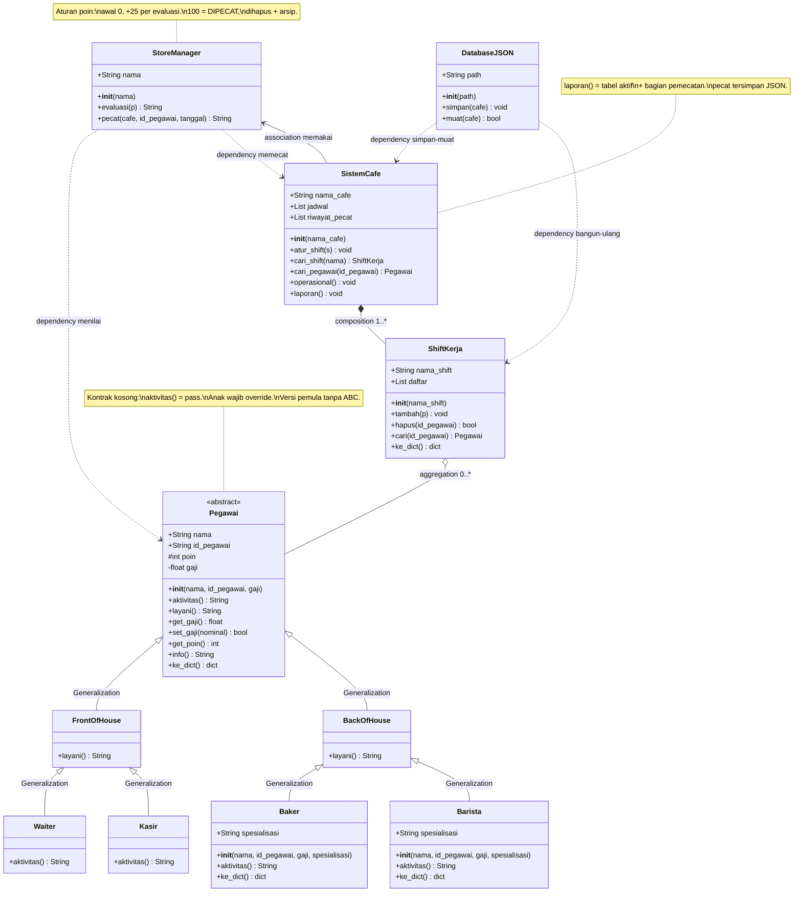

# Model UML — Sistem Manajemen Kafe Belbel Cafe & Bakery

## Analisis Kasus

Kafe butuh sistem nyata: tambah karyawan, catat gaji, nilai kinerja
(poin awal 0, +25 per evaluasi, 100 = dipecat), atur shift (buat,
hapus kosong, pindah pegawai), ubah gaji, lihat operasional/laporan
(termasuk laporan pemecatan). Kode teman (arsip/code_baru.py) idenya
benar tetapi ada bug dan belum rapi. Versi `kafe.py` memperbaikinya
dengan 11 class, sintaks pemula (hanya `import json`, tanpa dekorator).

## Diagram Class Lengkap

## Makna Tiap Relasi (Detail + Bukti Kode)

1. **Generalization — 6 panah segitiga kosong (pewarisan).**
   `Pegawai → FrontOfHouse`, `Pegawai → BackOfHouse`,
   `FrontOfHouse → Waiter`, `FrontOfHouse → Kasir`,
   `BackOfHouse → Baker`, `BackOfHouse → Barista`.
   Bukti: `class Waiter(FrontOfHouse):`, `class Baker(BackOfHouse):`.
   Anak mewarisi `nama, id_pegawai, _poin, __gaji, get/set, info,
   ke_dict` tanpa tulis ulang. `Baker/Barista` menambah
   `spesialisasi` via `super().__init__()` + override `ke_dict()`.
2. **Composition — berlian hitam (bagian ikut hidup-mati induk).**
   `SistemCafe *-- ShiftKerja` (1 cafe memiliki 1..* shift).
   Bukti: `self.jadwal = []` di `SistemCafe.__init__`,
   `atur_shift()`, simpan/muat JSON sekaligus dari cafe.
3. **Aggregation — berlian putih (bagian bisa lepas).**
   `ShiftKerja o-- Pegawai` (1 shift menampung 0..* pegawai).
   Bukti: `self.daftar = []`, `tambah(p)`, `hapus(id)`, `cari(id)`.
   Pegawai bisa pindah shift (menu 5.3) tanpa dihapus objeknya.
4. **Dependency — garis putus-putus (memakai sesaat).**
   a. `StoreManager ..> Pegawai`: `evaluasi(p)` membaca/menulis
   `p._poin` (+25 hingga 100 = DIPECAT).
   b. `StoreManager ..> SistemCafe`: `pecat(cafe, id, tanggal)`
   mencari di `cafe.jadwal`, menghapus via `s.hapus()`, mencatat ke
   `cafe.riwayat_pecat`.
   c. `DatabaseJSON ..> SistemCafe`: `simpan(cafe)` dump
   (`nama_cafe, shift, pecat`), `muat(cafe)` load + `buat_shift()`.
   d. `DatabaseJSON ..> ShiftKerja`: muat membangun ulang shift
   via `buat_shift()` + `buat_pegawai()` berdasarkan kunci `peran`.
5. **Association — garis biasa (kerja sama tetap).**
   `SistemCafe --> StoreManager`: menu 3 memanggil
   `manager.evaluasi()` + `manager.pecat()` dalam konteks cafe.

## Perbaikan dari Kode Teman (Audit)

| Masalah di arsip/code_baru.py | Perbaikan di kafe.py | Bukti uji |
|---|---|---|
| `__init__` lupa `self.id_pegawai`, `to_dict` crash | Ditambah + `ke_dict` konsisten | `Waiter.to_dict` lolos |
| 2 dekorator statik, `import os`, `with open` | Tanpa dekorator, hanya `import json`, `open/close` | 0 dekorator (AST) |
| Nama campur, JSON di root | Rapi: `ke_dict`, `data/karyawan.json` | File valid |
| `int(input(gaji))` crash ketik huruf | `tanya_angka` float, tolak `<=0`, tolak kosong | Huruf/kosong ditolak |
| Muat hardcode Pagi/Sore | Loop umum semua shift | Shift Malam aman |
| Duplikat ID bisa masuk | Dicek `cari_pegawai`, ditolak | W02 ganda ditolak |
| Poin `+10` tanpa batas, tanpa pecat | Awal 0, +25, 100 = DIPECAT + `hapus` + arsip | Andi 0→100 terhapus, muncul di laporan |
| Tanpa kelola shift/gaji di menu | Menu 5 shift (buat/hapus/pindah), menu 6 gaji | Teruji Eka pindah + gaji 3jt |

## Catatan Kritis: Abstraksi Versi Pemula

`Pegawai` ditandai `<<abstract>>` sebagai kontrak desain, tetapi di kode
hanya class biasa (`pass`). `Pegawai("Y","IDX",1000)` tetap bisa dibuat
dan `aktivitas()`-nya `None`. Ini disengaja agar tanpa dekorator.
Jawaban dosen: versi ketat memakai `ABC + abstractmethod`; pola warisnya
sudah benar. Fallback `buat_pegawai()` memberi peringatan bila `peran`
asing. `Barista` kini sejajar `Baker` (punya `spesialisasi` + override
`ke_dict`), jadi JSON-nya utuh saat muat ulang.

## Bukti Keselarasan

| UML | Kode `kafe.py` | Uji |
|---|---|---|
| 11 class + atribut/metode di atas | 11 nama sama, 0 dekorator | AST cocok |
| Abstract `aktivitas pass` | `def aktivitas: pass` | 4 override beda; lupa → `None` |
| `+nama +id #poin -gaji` | `self.nama/id/_poin/__gaji` | `set_gaji(-1)` ditolak |
| `Baker/Barista+super+spesialisasi` | `super().__init__` + `ke_dict` override | JSON simpan + reload utuh |
| `hapus()`, `riwayat_pecat`, laporan gabung | `ShiftKerja.hapus`, `pecat`, `laporan` | Andi hilang dari Pagi, ada di pemecatan |
| Composition/Aggregation | `jadwal/atur_shift`, `daftar/tambah/hapus` | Buat Malam, pindah Eka |
| Menu 1-7 | tambah/laporan/evaluasi/operasional/shift/gaji/simpan | Semua teruji + JSON awet |
| JSON round-trip | `simpan/muat`, `buat_pegawai/shift`, kunci `pecat` | Tutup-buka cocok |
