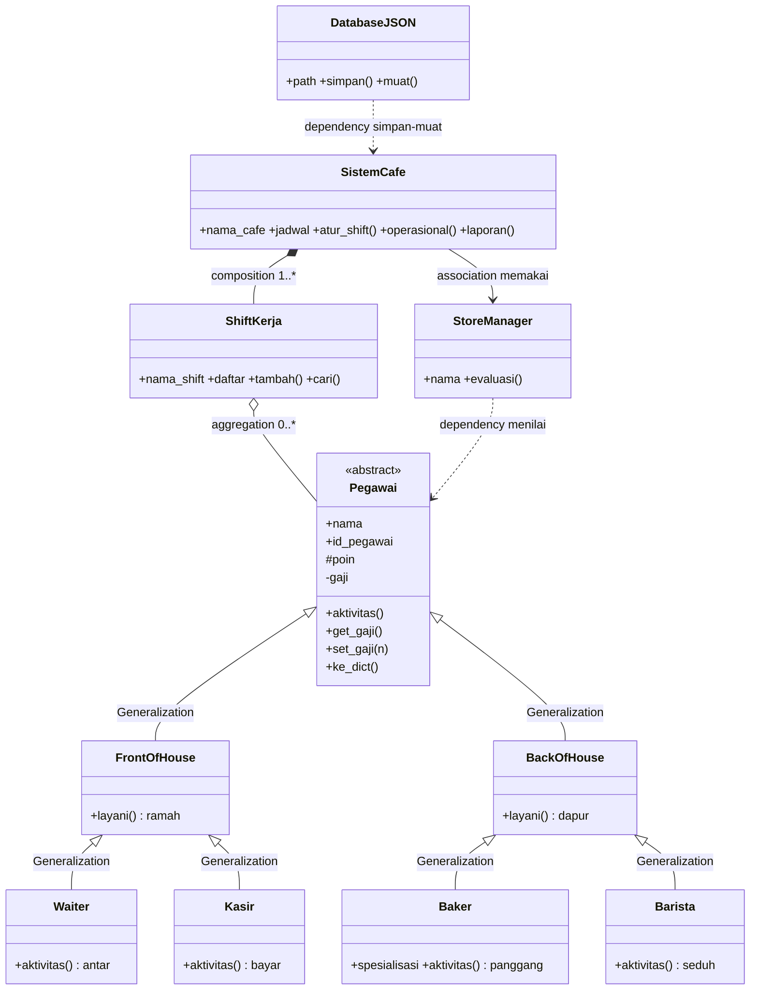

# Model UML — Sistem Manajemen Kafe Belbel Cafe & Bakery

## Analisis Kasus

Kafe butuh sistem nyata: tambah karyawan, catat gaji, nilai kinerja,
atur shift, lihat operasional. Kode teman (code_baru.py) idenya benar
tetapi ada bug dan belum rapi. Versi `kafe.py` memperbaikinya dengan
11 class, sintaks pemula (hanya `import json`, tanpa dekorator).

## Diagram Class

## Makna Relasi

1. Generalization 6 panah: `Pegawai→Front/Back`, `Front→Waiter/Kasir`,
   `Back→Baker/Barista`. Bukti: `class Waiter(FrontOfHouse):`.
2. Composition: `SistemCafe *-- ShiftKerja` via `self.jadwal`, `atur_shift`.
3. Aggregation: `ShiftKerja o-- Pegawai` via `self.daftar`, `tambah(p)`.
4. Dependency: `StoreManager ..> Pegawai` via `def evaluasi(self, p)`.
5. Dependency JSON: `DatabaseJSON ..> SistemCafe` via `simpan(cafe)/muat(cafe)`.

## Perbaikan dari Kode Teman (Audit)

| Masalah di code_baru.py | Perbaikan di kafe.py |
|---|---|
| `__init__` lupa `self.id_pegawai`, `to_dict` crash | Ditambah, diuji `Waiter.to_dict` lolos |
| 2 dekorator statik, `import os`, `with open` | Tanpa dekorator, hanya `import json`, `open/close` biasa |
| Nama campur `to_dict/FILE_NAME`, JSON di root | Rapi: `ke_dict`, `PATH=data/karyawan.json` |
| `int(input(gaji))` crash ketik huruf | `tanya_angka` float, tolak `<=0` |
| Muat hardcode Pagi/Sore | Loop umum semua shift, shift Malam aman |
| Duplikat ID bisa masuk | Dicek `cari_pegawai`, ditolak bila sama |
| Poin `+10` tanpa batas | Dibatasi `<200` |

## Catatan Kritis: Abstraksi Versi Pemula

`Pegawai` ditandai `<<abstract>>` sebagai kontrak desain, tetapi di kode
hanya class biasa (`pass`). `Pegawai("Y","IDX",1000)` tetap bisa dibuat
dan `aktivitas()`-nya `None`. Ini disengaja agar tanpa dekorator.
Jawaban dosen: versi ketat memakai `ABC + abstractmethod`; pola warisnya
sudah benar. Fallback `buat_pegawai()` kini memberi peringatan bila
`peran` asing.

## Bukti Keselarasan

| UML | Kode | Uji |
|---|---|---|
| 11 class | 11 class sama nama, 0 dekorator | AST cocok |
| Abstract `aktivitas pass` | `def aktivitas: pass` | Anak override 4 beda |
| `+nama +id #poin -gaji` | `self.nama/id/_poin/__gaji` | `set_gaji(-1)` ditolak |
| `Baker+spesialisasi+super` | `super().__init__` + `ke_dict` override | JSON simpan spesialisasi |
| Composition/aggregation | `jadwal/tambah`, `daftar/tambah` | Tambah Eka masuk Pagi |
| JSON round-trip | `simpan/muat`, `buat_pegawai` | Tutup-buka data tetap, poin 110 tersimpan |
